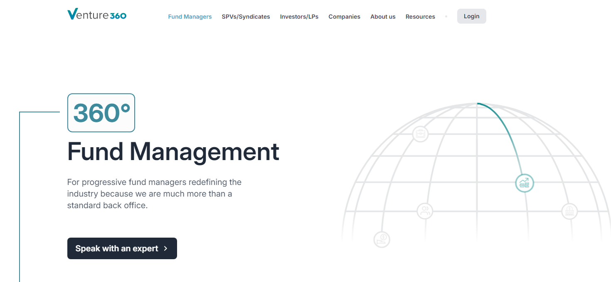

import Image from '@site/src/components/Image';

# Fund Managers Registration

Venture360 offers a seamless user registration process for investors to access the platform and engage with investment opportunities. Follow these steps to get started:

## Step 1: Invitation Email

- Fund managers will receive an email after talking to a an exper at sales at [Venture360](https://www.venture360.co/fund-management).
  <!--  -->

  <Image src='docs/Screenshot10.png' />

## Step 2: Account Creation

- Click on the registration link provided in the invitation email.
- Fill out the required registration form with necessary information such as name, email, and password.
- Agree to the terms of service and privacy policy.
- Click on the "Sign Up" button to create your account.

## Step 3: Profile Management

- Upon logging in, Fund managers can update their profile information as needed.
- This includes adding or editing personal details, contact informations etc

## Step 4: Support and Assistance

- For any questions or assistance with registration or using the platform, reach out to our dedicated support team.
- Click on the "Support" or "Contact Us" section within the platform to submit inquiries or request help.